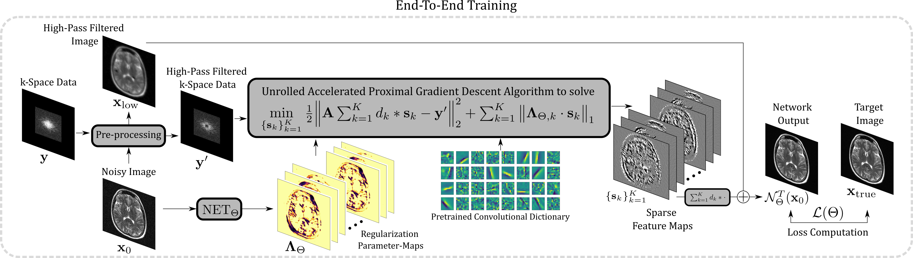

# Learning L1 Norm Weights For Convolutional Synthesis-based Regularization
Learning spatially adaptive L1 norm weights for convolutional synthesis-based regularization using algorithm unrolling.

We are currently working on integrating all necessary building blocks for the proposed approach into [MRpro](https://github.com/ckolbPTB/mrpro), after which you will find code to apply the method to MR image reconstruction problems.
