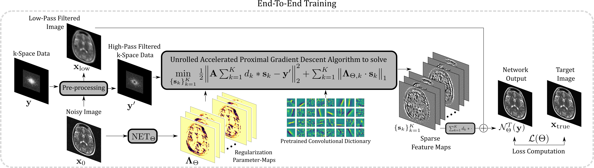
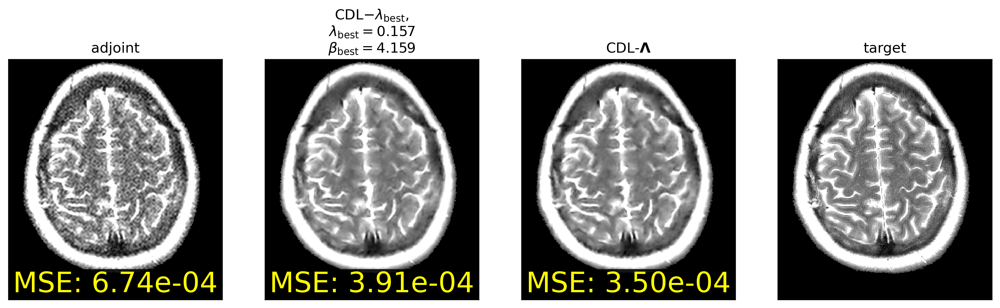
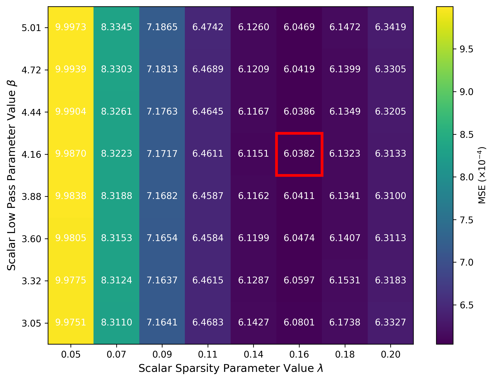
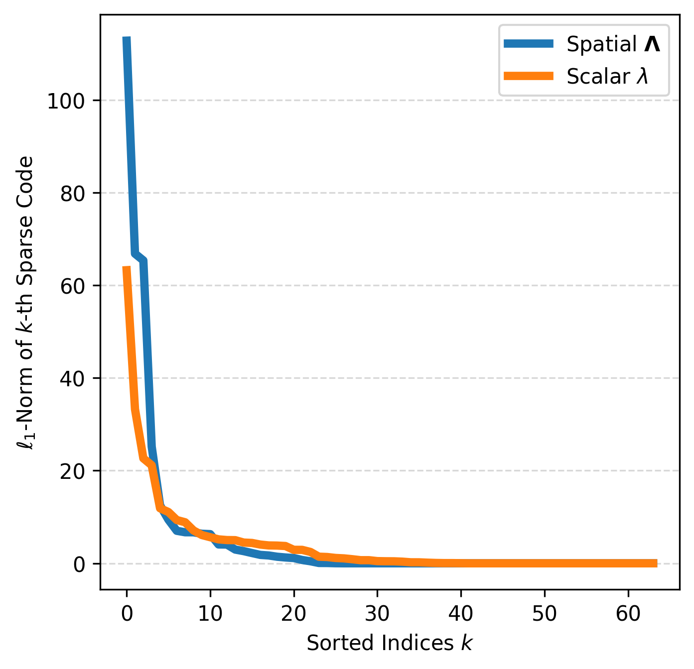
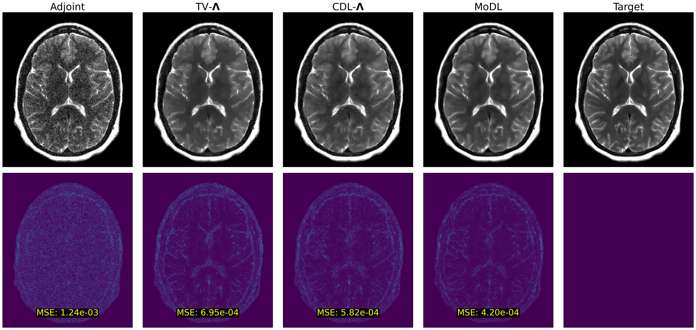
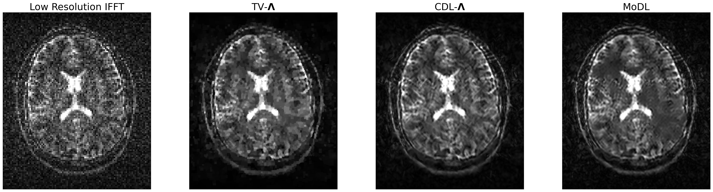

# Learning L1 Norms Weights For Convolutional Synthesis-based Regularization
Learning spatially adaptive L1 norms weights for convolutional synthesis-based regularization using algorithm unrolling.



## Installation
This code uses ```MRpro``` for the implementation of the operators and the unrolling of FISTA. 

To use the code
1. Create a python environment (e.g. ``` conda create -n adaptive_l1 python=3.12 ```)
2. Download and install ```MRpro``` (see <https://github.com/PTB-MR/mrpro>)
3. Clone this environment and install it as a package via ```pip install -e .```

Note that this implementation deviates (in a positive way ;) from the implementation used for the original submission.

## Usage
Here, we use the fastMRI multicoil brain dataset (see <https://fastmri.med.nyu.edu/>). To be able to use the repository, first download the dataset and put the `*.h5` files into a folder, which you should then specify in the config files.
Open the file `configs/data.yaml` and set the paths as you need
````python
# the directory containing all .h5 files
data_dir:
  /your/path/to/the/h5/files/

# the directory containing the .txt files of the splits; 
# "fastMRI_training.txt", "fastMRI_validation.txt" and "fastMRI_testing.txt"
split_dir:
  /your/path/to/the/fastMRI/split/files

# the directory containing the convolutional dictionary filters as .pt files
conv_dictionary_dir:
  /your/path/to/the/convolutional/dictionary/filters
````
To be able to use the provided data splits, you need to download the multicoil-brain fastMRI dataset (i.e. all batches of the training and validation dataset, which provide fully sampled k-space data).
If you want to only use a smaller amount of data for training, validation and testing. You can create your own splits by
````python
from adaptive_l1.data.utils import create_data_split
data_dir = ... # the directory containing all the .h5 files
split_dir = ... # where you want to put your split files
create_data_split(data_dir, split_dir)
````


### Data Loading and retrospective data simulation
Retrospectively generate Low-Field MR data
```python
import mrpro
import torch
from adaptive_l1.data.utils import read_split_file
from adaptive_l1.data.data_classes import LowFieldMRDataset
from adaptive_l1.data.utils import load_config

cfg_data = load_config("your/path/configs/data.yaml")

noise_std = 0.3 #noise standard deviation
n_k1 = 160 # number of acquired samples (phase encoding direction)
n_training = 9 #only load a subportion of all available files

data_dir = cfg_data["data_dir"]
split_dir = cfg_data["split_dir"]

training_files = read_split_file(
    data_dir=data_dir,
    split_file=split_dir + "fastmri_training.txt",
)[:n_training]

training_image_data = mrpro.phantoms.FastMRIImageDataset(
    path=training_files,
    coil_combine=True,
)

training_data = LowFieldMRDataset(
    image_dataset=training_image_data,
    noise_variance=noise_std**2,
    n_k1=n_k1,
    base_seed=,
)

training_loader = torch.utils.data.DataLoader(
    training_data, batch_size=1, shuffle=False
)

sample_id = 27
batch = next(itertools.islice(validation_loader, sample_id, sample_id + 1))

device = torch.device("cuda" if torch.cuda.is_available() else "cpu")
kdata = batch["kdata"].to(device)
adjoint = batch["adjoint"].to(device)
mask = batch["mask"].to(device)
target = batch["target"].to(device)
```

### Reconstruction
Then, reconstructing images with the CDL-$`\Lambda`$ method can be done by 

```python
# import models
from adaptive_l1.models.unet import UNet
from adaptive_l1.models.spatially_adaptive_conv_synthesis import SpatiallyAdaptiveConvSynthesisNet2D, ConvSynthesisParameterMapNetwork2D
# define your convolutional dictionary
n_filters = 32
conv_dictionary_kernel = torch.randn(n_filters, 9, 9)

#define the CNN backbone used to estimate the sparsity level maps from input images
unet = UNet(dim=2,
  n_ch_in=2,
  n_ch_out=n_filters,
  n_enc_stages=3,
  n_convs_per_stage=2,
  n_filters=16,
  kernel_size=3,
  pooling_kernel_size=2)

# wrap it with the network that takes care of reshaping the complex-valued input etc
parameter_map_network = ConvSynthesisParameterMapNetwork2D(cnn_block=unet)

# define the reconstruction model
model = SpatiallyAdaptiveConvSynthesisNet2D(
            kernel = conv_dictionary_kernel,
            parameter_map_network=parameter_map_network,
            n_iterations=64)

# inference (requires an initial image, the k-space data, and the MRpro mask operator)
cdl_lambda_map_reconstruction = model(initial_image, kdata, mask_operator)
```

Further, an implementation of the model-based deep learning method (MoDL - https://arxiv.org/abs/1712.02862) and the spatially adaptive TV with regularization parameter maps estimated from an input image (https://arxiv.org/abs/2301.05888) are also available and can be used analogously.

```python
# import the models
from adaptive_l1.models.modl import MoDLBlock, MoDL
from adaptive_l1.models.spatially_adaptive_tv import SpatiallyAdaptiveTVNet2D,  TVParameterMapNetwork2D
```

## Training and Testing
To train and test the models, simply run `bash run_trainings.sh` and `bash run_tests.sh`. Training and testing are carried out on all the images of the `.h5` files indexed by the respective split files. Training takes several days, especially for TV-$`\boldsymbol{\Lambda}`$ and CDL-$`\boldsymbol{\Lambda}`$. Testing will produce the `.csv` files that you can find in the folders of the respective runs.
Here, we provide one pre-trained MoDL model, one pre-trained TV-$`\boldsymbol{\Lambda}`$ model and three different pre-trained CDL-$`\boldsymbol{\Lambda}`$ models, which differ in the pre-trained convolutional dictionary they use. Thereby, we provide model that use $`K=16`$, $`K=32`$, and $`K=64`$, convolutional dictionary filters. The corresponding U-Nets to estimate the sparsity level maps therefore also vary in terms of number of filters etc. See also one of the training config files of CDL-$`\boldsymbol{\Lambda}`$ for more details.


## Main Results

By `bash run_figures.sh` you can run the python files to recreate the following figures, which summarize the main results for the method.

### Improvement over Scalar Sparsity Level Parameter
The following shows the improvement of using sparsity level maps over the scalar sparsity level parameter. Note that the sparsity level parameter maps were estimated from the noisy input image, while the scalar parameter was obtained by grid-search, which is unfeasible in practice.  
<table>
  <tr>
    <td align="center">
      
    </td>
    <td align="center">
      
    </td>
  </tr>
</table>

### The Sparsity Level Maps

On the left, you can see 12 out of 64 sparse codes (top and middle row) together with their estimated sparsity level maps and the associated filters (third) row. The sparse codes and sparsity level maps are the first six (column one to six) and the last six (column 7 to 12) after having sorted the $`\ell_1`$-norms of the sparse codes in descending order of magnitude. On the right, you see the sorted $`\ell_1`$-norms of the sparse codes when using the best scalar sparsity parameter (orange; again, obtained by line search) and the spatially adaptive sparsity level parameter maps (blue).

<p align="center">
  
  
</p>

### Comparison with TV-$`\boldsymbol{\Lambda}`$ and MoDL
Here, you can see a figure comparing the proposed CDL-$`\boldsymbol{\Lambda}`$ with TV-$`\boldsymbol{\Lambda}`$ and MoDL. The first figure shows a comparison on an image of the test set of the fastMRI data that was used for training. The second figure shows the application of the methods to in-vivo data. More precisely, to T2-weighted image obtained using a OSI$`^2`$ Low Field MR scanner operating at 50 mT. Although MoDL surpasses both TV-$`\boldsymbol{\Lambda}`$ and CDL-$`\boldsymbol{\Lambda}`$ on the fastMRI dataset, on this (somewhat out of distributio data), it qualitatively clearly performs worse by entirely smoothing out some regions.






## Citation
If you find this code useful and use it for your work, please cite
```python
@inproceedings{kofler2025learning,
  title={Learning Spatially Adaptive $$\backslash$ell\_ $\{$1$\}$ $-Norms Weights for Convolutional Synthesis Regularization},
  author={Kofler, Andreas and Calatroni, Luca and Kolbitsch, Christoph and Papafitsoros, Kostas},
  booktitle={2025 33rd European Signal Processing Conference (EUSIPCO)},
  pages={1782--1786},
  year={2025},
  organization={IEEE}
}
```

## Further readings
- An extension of the CDL-$`\Lambda`$ method (accepted for ICIP 2026) to be able to change the convolutional dictionary at inference time can be found here.
https://arxiv.org/pdf/2602.21707.
